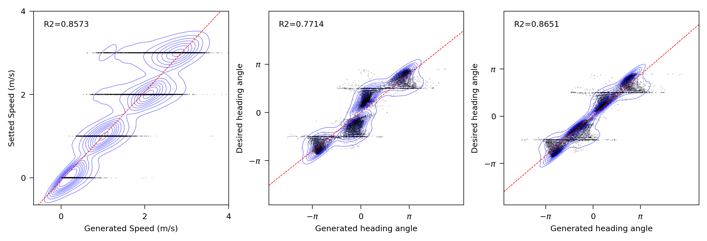
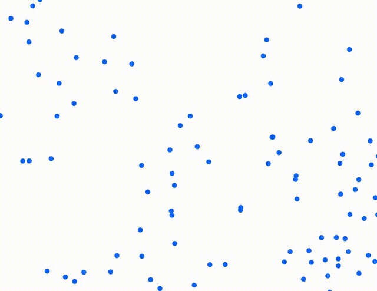
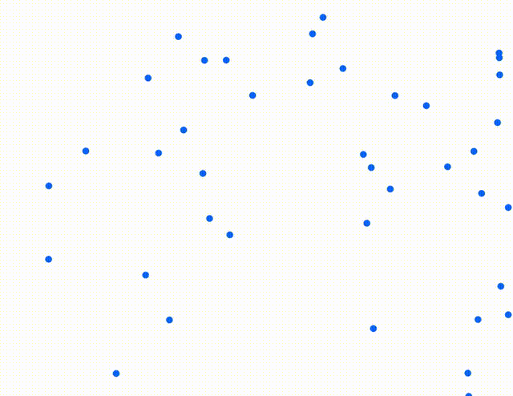
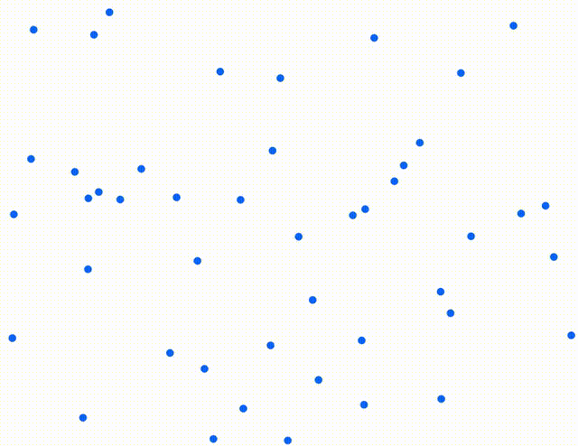
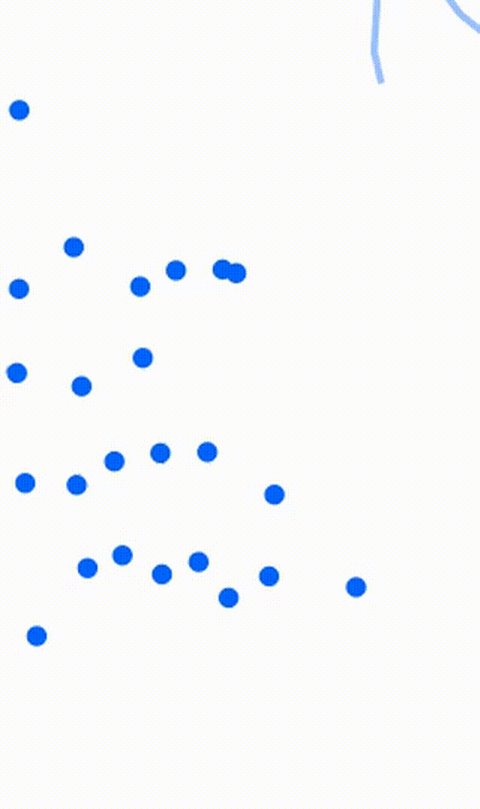
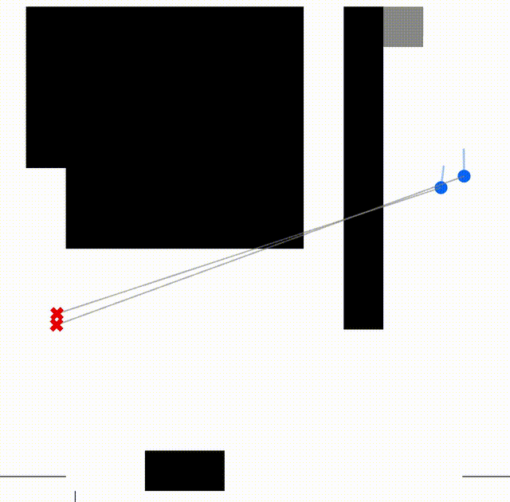
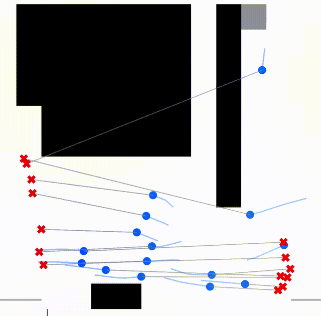

# Controllability Analysis & Failure Cases

> This section presents quantitative controllability analysis results as well as Failure Cases of the RAPID framework for pedestrian trajectory generation, prepared as supplementary materials in response to reviewer AZuQ's comments during the KDD Rebuttal.

## Controllability Analysis

We systematically evaluated the model's capabilities in speed and heading control by comparing the alignment between **commanded inputs** and **generated outputs**.

The figure above contains three subplots, each demonstrating performance under different control dimensions:
- **Left: Speed Control**
    - **X-axis**: Generated Speed (m/s)
    - **Y-axis**: Setted Speed (m/s)
    - **R² = 0.8573**: Shows strong linear correlation, demonstrating precise velocity following capability
- **Middle: Heading Control @ 12 steps**
    - **X-axis**: Generated heading angle
    - **Y-axis**: Desired heading angle
    - **R² = 0.7714**: High consistency between generated trajectory heading and target direction over a 12-step (short horizon) simulation
- **Right: Heading Control @ 24 steps**
    - **X-axis**: Generated heading angle
    - **Y-axis**: Desired heading angle
    - **R² = 0.8651**: Extended simulation to 24 steps further improves directional accuracy, indicating stable long-horizon controllability

This quantitative results validate that our Physics-Guided Diffusion Sampling mechanism successfully achieves precise speed control capability and destination following capability.

## Failure Cases

Although RAPID can generate realistic pedestrian-pedestrian and pedestrian-vehicle interactions, it still encounters issues when pedestrian density is high and obstacle shapes are complex. In these situations, the social forces model's guidance can conflict with the prior learned by the model, leading to anomalous behaviors.

In the videos below, white colors indicates passable areas, black colors denotes obstacles, the blue dots represent pedestrians, and the trails show the historical positions over the past 2 seconds. To facilitate observation, we have extended the simulation duration to 15~30s (equivalent to 32.5~75 steps, far exceeding the 12 steps used during training and testing). The videos are played at 5x speed. (If the videos do not load, please refer to the `assets/` folder directly.)

The four videos below demonstrate the simulation results for the four frames with the highest instantaneous traffic volume in the GC Dataset, where pedestrians traversing through dense crowds generate unsmooth trajectories and unavoidable collision behaviors.

| Case 1 (GC) | Case 2 (GC) | Case 3 (GC) | Case 4 (GC) |
|---------|---------|---------|---------|
|  |  |  |  |

The 2 videos below illustrate situations in the UCY Dataset (Zara 01) where pedestrians move from the top right corner of the map to the left side. Here, when pedestrians get too close to obstacles, they struggle to bypass them to reach their destinations (where the red crosses represent the pedestrians' destinations).

| Case 1 (UCY) | Case 2 (UCY) |
| --- | --- |
|  |  |

In principle, the first type of failure case primarily arises because the pedestrian embeddings do not explicitly encode the states of their neighbors. Instead, it relies on adding frequency-domain positional encodings, causing the pedestrian embeddings to query neighbor embeddings via a cross-attention mechanism. This leads to mixed information when there are many neighbors, making it difficult for the model to find a solution that perfectly avoids all of them. The second type of failure case mainly occurs because the map compression encoding makes it difficult for pedestrians to clearly perceive distant pathways, preventing them from using this information to navigate to their destination by temporarily moving away from it. These issues can be mitigated by adding neighbor information into the pedestrian embeddings and increasing the number of learnable embeddings in the map compression encoding. However, this would increase the computational load and prolong inference time. Considering that such extreme pedestrian densities and complex obstacle shapes typically do not appear in mixed traffic scenarios involving vehicles, we believe it is more valuable to appropriately sacrifice the ability to handle these scenarios in exchange for real-time processing speed.

In normal scenarios, the model can exhibit regular movement behaviors. The following videos demonstrate pedestrian-pedestrian interactions in scenarios with a large number of pedestrians, where pedestrians naturally and smoothly avoid each other while moving toward their destinations.

| Ped-Ped1 | Ped-Ped2 | Ped-Ped3 |
|---------|---------|---------|
|  |  |  |

The following videos demonstrate human-vehicle interactions, where pedestrians flexibly adjust their speed and movement direction in advance to get ahead of or avoid other vehicles.

| Ped-Veh1 | Ped-Veh2 |
|---------|---------|
|  |  |

The realism of the videos above can be better demonstrated by comparing it with the simulation results of social forces models (SFM). In SFM's simulation results, pedestrians cannot sense vehicles approaching from a distance and can only avoid them by making unreasonable movements when they are rapidly approaching within a certain range.

| Ped-Veh1 (SFM) | Ped-Veh2 (SFM) |
|------------------------|------------------------|
|  |  |