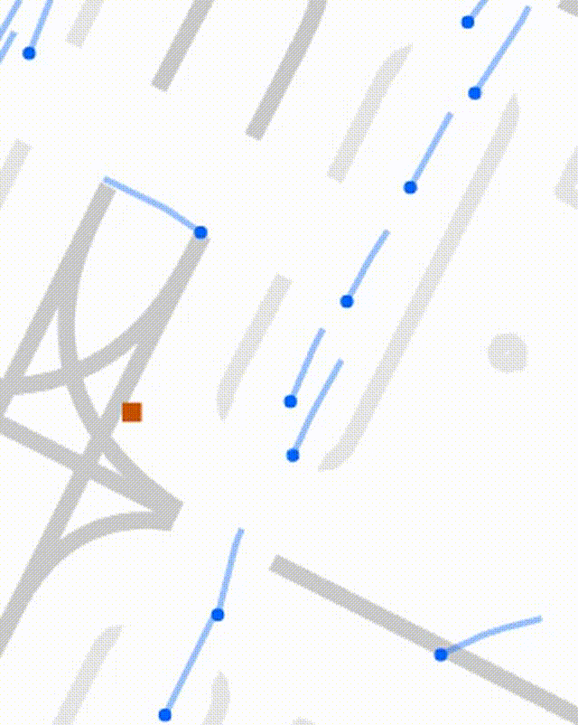
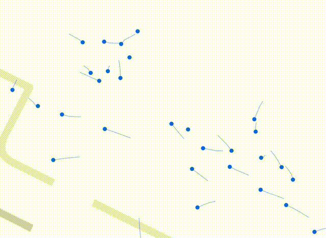
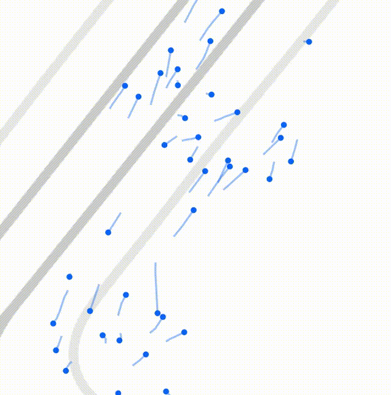
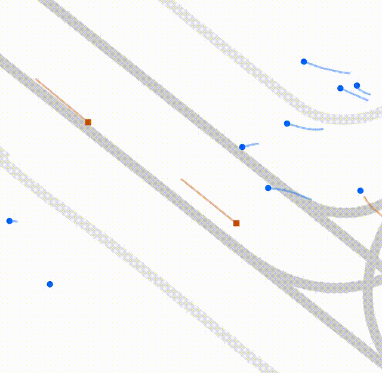
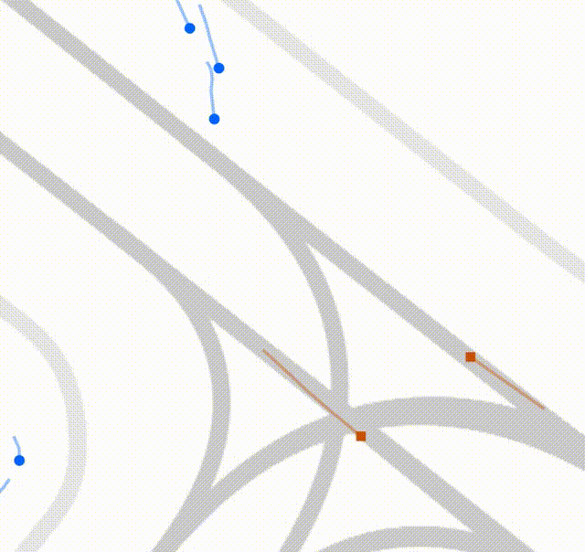
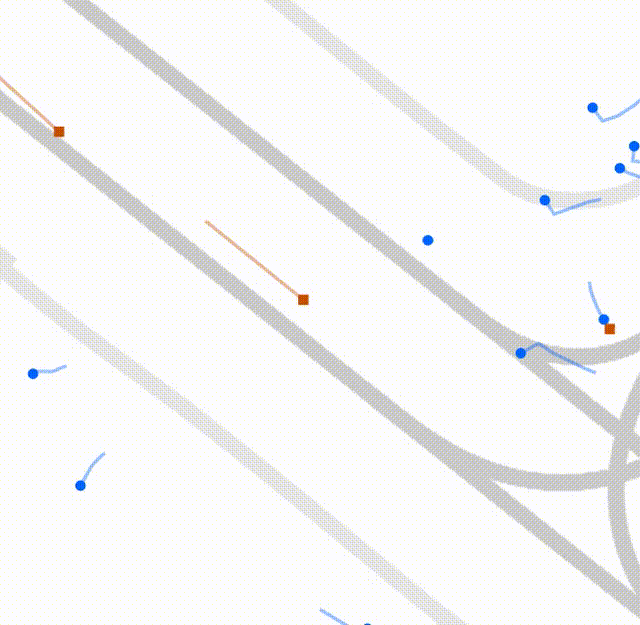
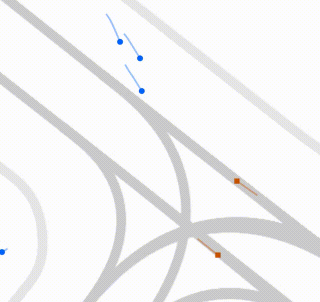

# More Concrete Qualitative Case Studies

> This section presents visualization videos as concrete case studies, prepared as supplementary materials in response to reviewer KFSt's first concern during the KDD Rebuttal.

Although we have already provided concrete qualitative case studies in Figure 3 of the manuscript, we agree that additional case studies can help further illustrate the model's dynamic behavioral characteristics. Therefore, we have prepared the visualization trajectories below, where we use the model jointly trained on all datasets (i.e., the "Ours (Unified, Physics)" row in Table 2) to simulate scenarios on the WayMo dataset.

To facilitate observation, we have extended the simulation duration to 15~30s (equivalent to 32.5~75 steps, far exceeding the 12 steps used during training and testing). In the figures, blue dots represent pedestrians, orange squares represent vehicles, and trails represent trajectories from the past 2s. Videos are played at 5x speed. 

(If the videos do not load, please refer to the `assets/` folder directly.)

The following videos demonstrate pedestrian-pedestrian interactions in scenarios with a large number of pedestrians, where pedestrians naturally and smoothly avoid each other while moving toward their destinations.

| Ped-Ped1 | Ped-Ped2 | Ped-Ped3 |
|---------|---------|---------|
|  |  |  |

The following videos demonstrate human-vehicle interactions, where pedestrians flexibly adjust their speed and movement direction in advance to get ahead of or avoid other vehicles.

| Ped-Veh1 | Ped-Veh2 |
|---------|---------|
|  |  |

The realism of the videos above can be better demonstrated by comparing it with the simulation results of social forces models (SFM). In SFM's simulation results, pedestrians cannot sense vehicles approaching from a distance and can only avoid them by making unreasonable movements when they are rapidly approaching within a certain range.

| Ped-Veh1 (SFM) | Ped-Veh2 (SFM) |
|------------------------|------------------------|
|  |  |
