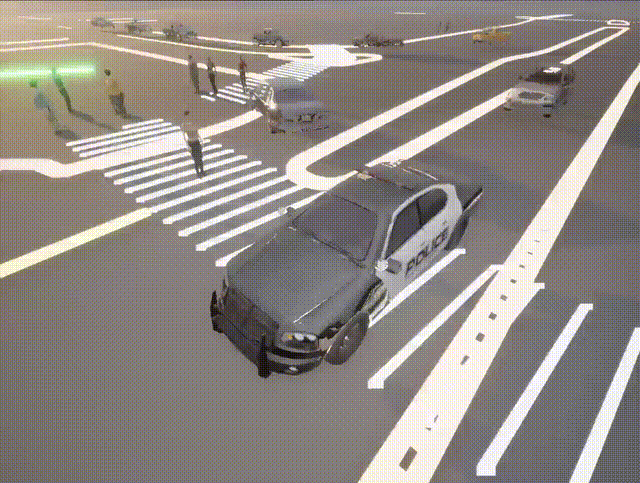
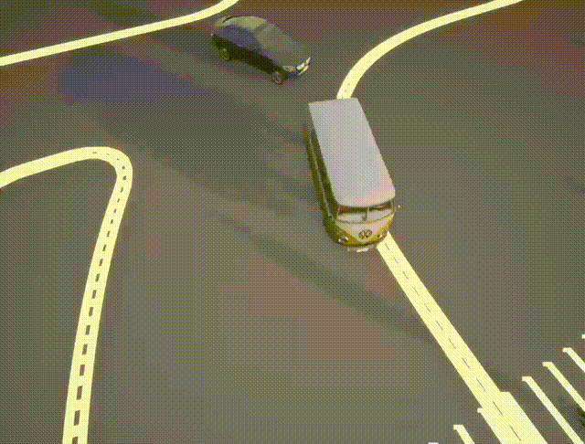
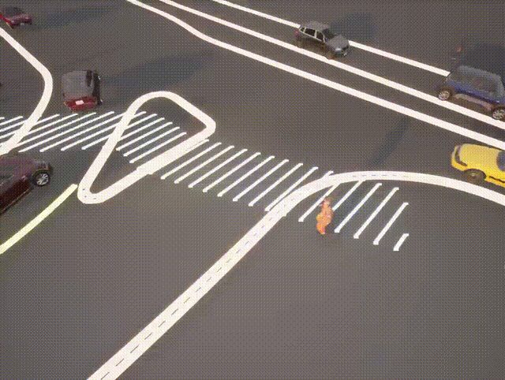

# Performance in Online Production Environments

> This section demonstrates the actual performance of the RAPID framework when deployed in an online production environment, prepared as supplementary materials in response to reviewer cust's first concern during the KDD Rebuttal.

The following visualization videos illustrate dynamic pedestrian-vehicle interactions across various Waymo scenarios generated by RAPID deployed on downstreaming autonomous driving simulation systems, CARLA. Rendered directly through the CARLA simulator in an online setting, these demonstrations highlight our model's capability to generate authentic and natural human trajectories. Notably, the generated pedestrians exhibit fluid, responsive motions, effectively avoiding vehicles while navigating towards their destinations. (If the videos do not load, please refer directly to the `assets/` folder.)

| Demo1 | Demo2 | Demo3 |
|-------|-------|------|
|  |  |  |
